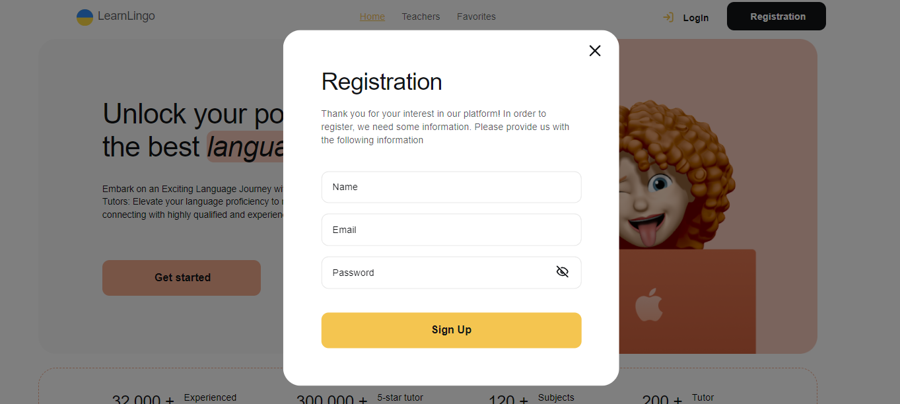
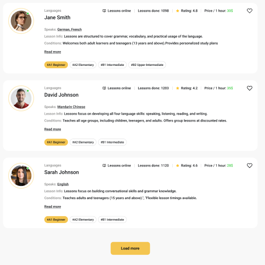
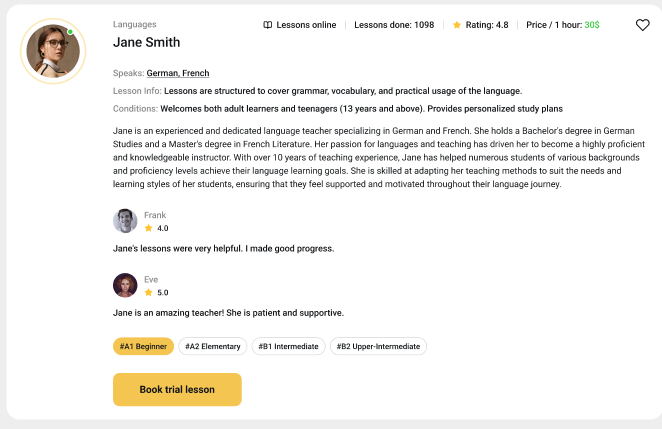
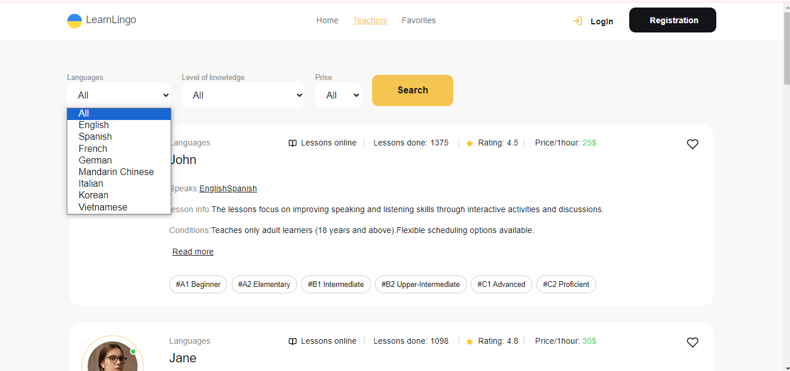

<a name="readme-top"></a>

  <h1 align="center">Learn Lingo</h1>

  <p align="center">
    This project is an application  that will help users learn languages with their favorite speakers.</p>

<!-- TABLE OF CONTENTS -->
<details>
  <summary>Table of Contents</summary>
  <ul>
    <li><a href="#features">Features</a></li>
    <li><a href="#technologies">Technologies</a></li>
    <li><a href="#getting-started">Getting Started</a></li>
    <li><a href="#installation">Installation</a></li>
                                                        
  </ul>
  </details>

<!-- ABOUT THE PROJECT -->

## Features

<ul>
  <li>
    <p>Registration, login, to get the current user, logout users.</p>



  </li>
  <li>
  <p>A "Home" page with a list of company benefits and a link to get started with the application and redirect to the "Teachers" page. Stylization is implemented with different palette variations.</p>


  </li>
  <li>
  <p>Rendering of the list of cards. Four cards are rendered on the  "Teachers" page, and the rest are loaded by clicking on the button "Load more".</p>
  

  </li>
  <li>
    <p>Mark cars as favorites. A private "Favorites" page is available for an authorized user, when going to which the user has the opportunity to view all teacher cards that he has added to "favorites".</p>
  </li>
  <li>
    <p>A card with description of the teacher`s characteristics. When you click on the button "Read more", the card opens with more detailed information about the teacher and feedback from his students. If you click on the button "Book trial lesson", a modal window opens with a form for booking a trial class. The modal window is closed by clicking on the button in the form of a "cross", by clicking on the backdrop or pressing the Esc key. </p>



  </li>
  <li><p>Filtering by the language of instruction, by the level of students`knowledge and by the price per lesson hour.</p>
  

  </li>
</ul>

Technical task
https://docs.google.com/document/d1ZB_MFgnnJj7t7OXtv5hESSwY6xRgVoACZKzgZczWc3Y/edit
Figma layout
https://www.figma.com/file/dewf5jVviSTuWMMyU3d8Mc/Learn-Lingo?type=design&node-id=0-1&mode=design&t=SVW3nqE3y6WazVGo-0

## Technologies

<ul>
  <li><p>React.js - for frontend implementation</p></li>
  <li><p>Firebase - backend</p></li>
  <li><p>Firebase Realtime Database - database</p></li>
  <li><p>Redux Toolkit - to store the state of the components</p></li>
  <li><p>Styled Components- application styling</p></li>
  <li><p>Redux-persist - data storage of the current user</p></li>
  <li><p>Formik & Yup- forms and validation</p></li>
  <li><p>React-hot-toast - pop-up messages</p></li>
  <li><p>React-modal - modal windows</p></li>
</ul>

<p align="right">(<a href="#readme-top">back to top</a>)</p>

<!-- GETTING STARTED -->

## Getting Started

To get started with this project, follow installation instructions below

## Installation

1. Clone the repo
   ```sh
   git clone https://github.com/oksanamarusich/Learn-Lingo.git
   ```
2. Install NPM packages
   ```sh
   npm install
   ```
3. Start the development server
   ```sh
   npm start
   ```
4. Open https://oksanamarusich.github.io/Learn-Lingo/ to view in the browser

<p align="right">(<a href="#readme-top">back to top</a>)</p>
